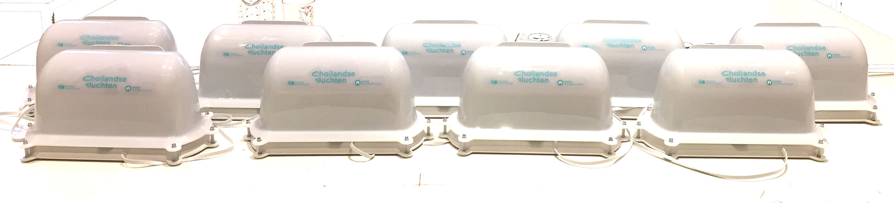

# holu-kit-20
Hollandse Luchten sensor kit, version 2.0.

 

This repo has the scope to host the source files of the HoLu kit v2.
In the repo there are:
- sketches for basic and extended HoLu kit
- 3D model of the case
- pcb files and images
- BOM

Some extra information:
- Assembling manual of the HoLu kit: https://hollandseluchten.waag.org/wp-content/uploads/sites/9/HOLU_manual_English.pdf
- Parts descriptions: https://hollandseluchten.waag.org/holu-sensorkit/
- Troubleshooting: https://hollandseluchten.waag.org/veelgestelde-vragen/

In this repo you also find the presentations related to the HoLu kit, the slides have been used during internal meetings and meet-up with the participants of the projects.

Missing:
- ~~3D model of the moulds~~: the 3D models of the moulds were designed by the company that produced the casings, the moulds are based on the original 3D models you find in this repo.
- 2D model internal acrylic plate.
